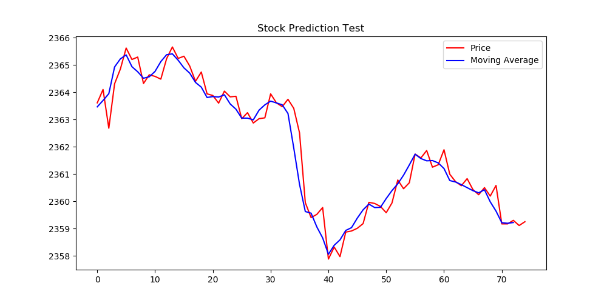

# HighFrequencyStockTradingAI
This program is an example of how artificial intelligence can make sense of information from the stock market, and attempt to evaluate better investing decisions.

Below are visualizations and explanations showcasing the development and thought-process behind our this artificial intelligence works.

First, we import the the history of a stock, graph it so it's easy to understand, and create a moving average graph to help understand the momentum of the stock.

